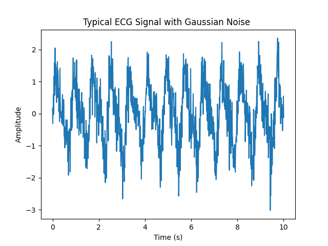

# Heart Beat Signal Generator

This is a single page application utilizing a python script that generates a cyclical signal of a Heart Beat.

### This applications accomplishes the following tasks:

1. Generate a cyclical Heart Beat signal
2. Send the data to a MQTT client. This script will only send this to a localhost client
3. Run the application indefenitely
4. Make the application configurable

## Requirements

see[requirements.txt]() for the packages required to get this system up and running.

## Software Execution flow

## ToDo

- [ ] Save PNG
- [ ] GEN JSON
- [ ] 

### TODO

